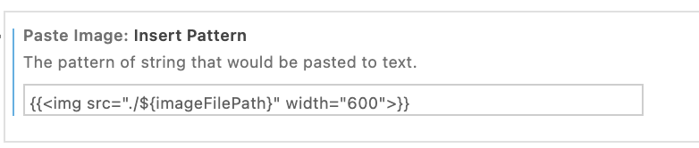
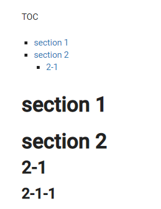

# Hugo

- hugo/themes配下に、docdockのテーマをgit submodule してあります。

  https://github.com/vjeantet/hugo-theme-docdock

  ```
  git submodule update -i
  ```

- ローカルで確認

  ```
  hugo server -D --enableGitInfo
  ```

  >lastmodで更新日付が出るページと表示できないページがある。日本語ファイル名の問題らしい？！

- パブリッシュ

  ```
  hugo -D --enableGitInfo
  ```


hugo folder の config.toml は、一階層上の src 配下のフォルダを参照しています。

```
theme="hugo-theme-docdock"

[[module.mounts]]
  source = "../src"
  target = "content"
```

hugo-theme-docdock のテーマを設定してあります

  https://docdock.vjeantet.fr/

- hugo の shortcode img.html を利用しています。

  - ./layouts/shortcode/image.html

    フォルダの配下の img というフォルダにある画像を hugo で表示するショートコードです

     タグを{{}}で括っておくことで、 shortcode img と認識されます。

    ```md
    {{}}
    ```

    vs code の extension である Paste Imageで下記の設定をすると便利です。

    

- mermaid js の設定をしてあります。

  https://anis.se/posts/add-mermaidjs-support-to-hugo/

  - ./layouts/partials/custom-footer.html

    ````
    <!-- Add mermaid min js file -->
    <script
    	src="https://cdnjs.cloudflare.com/ajax/libs/mermaid/8.6.0/mermaid.min.js"
    	crossorigin="anonymous"
    ></script>
    <!-- Initializes mermaid js.
    	Main reason to use .init rather than .initialize is that .init allows to pass in a class selector.
    	Hugo's markdown code fences ```mermaid ``` will create a html code block with class .language-mermaid.
    	This can then be used by mermaid to generate the correct diagrams with code fences
    -->
    <script>
    	mermaid.init(undefined, ".language-mermaid");
    </script>
    ````

- .Lastmod.Format の設定をしてあります。


  >lastmodで更新日付が出るページと表示できないページがある。日本語ファイル名の問題らしい？！


  ./layouts/partials/flex/body-beforecontent.html

    ```
    {{if not .IsHome}}<div align="right">Last Modified: {{ .Lastmod.Format "2006-01-02" }}</div>{{end}}
    ```

- ./static/theme-flex/style.css

  table width を 100% から autoに変更してあります。
  ```
   article section.page table {
    width: auto;
  ```

Table Of Content

- md ファイルにある {}の記述は、hugo 用です。VS Code のプレビューでは表示されません。

ページ内のヘッダーが2階層まで表示されます。


