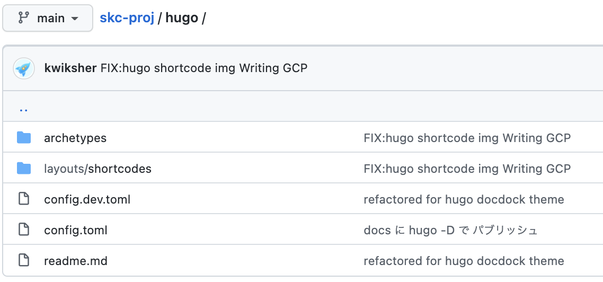
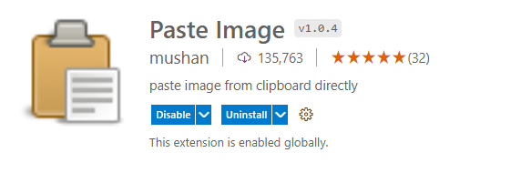
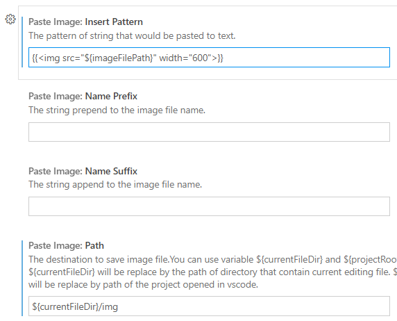
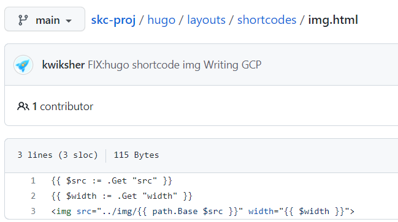

## VS Code の extension

- Excel to Markdown Table
- Markdown All in One
- Markdown PDF
- Markdown Preview Github Styling
- Markdown Preview Mermaid Support
- Marp For VS Code
- Paste Image

## mermaid.js について

- [ガントチャート](https://mermaid-js.github.io/mermaid/#/gantt)

- [mermaid でガントチャート <軸のフォーマットを変更する方法>](https://h-s-hige.hateblo.jp/entry/20190312/1552390012)

hugo について

- hugo をインストールしてください

  https://gohugo.io/getting-started/installing/

- skc-proj では、docdocks の theme を採用しています。docdocks のテーマを個別に DL して themes フォルダに格納してください。

  https://github.com/vjeantet/hugo-theme-docdock

- config.toml や shotcodes のファイルでカストマイズしています。skc-proj/hugo のファイルを使用して下さい。

  https://github.com/skc-syscore/skc-proj/tree/main/hugo

  

## Hugo の表記について

マークダウンファイルの先頭に下記のようなメタデータを書き込むと、トピック(chapter)として取り扱われます。weight は、順番を指定するものです。

```
---
title: "00 My Title"
chapter: true
weight: 1
---

内容

```

マークダウンファイルを格納するフォルダ構造で、トピックが管理されて、html に出力されます。


現在 config.toml が hugo フォルダに格納されていて、そこからの相対パスで動作するようになっているので、
skc-proj/hugo フォルダで、hugo コマンドを起動します。

レビュー用のローカルサーバの起動

```
cd hugo

hugo server -D  --enableGitInfo
```

-D はドラフトも含むです。

内容のレビューが済んだら、hugo -D して、出力します。docs フォルダーが更新されます。

```
hugo -D  --enableGitInfo
```

github docs を設定すると、公開できます。

docs フォルダに一式入っているので、ローカルの http-server を docs 指定で立ち上げれば、閲覧可能です。

---
### Paste Imageについて



VS Codeのエクステンションを利用して、スクリーンコピーし、クリップボードに入っている画像データを、img タグでマークダウンに埋め込みます。

ペーストした画像データは、img フォルダに格納される設定を行います。Paste Imageの設定を開き、以下の２つを設定してください。


- Path :

  ```js
  ${currentFileDir}/img
  ```

- Insert Pattern 下記のimgタグを{{}}で囲って、設定してください。

  ```js
  
  ```


  

VS Codeでは、img フォルダへの相対パス参照で、マークダウンプレビューで画像が表示されます。Hugoでは、同じ階層にある_index.mdとそれ以外のxxx.mdで、imgフォルダへの相対パス参照が異なります。

HugoのHTML生成ロジック

- _index.md -> img/yyy.png
- xxxx.md ->  ../img/zzz/png

この仕様のために、ショートコードで xxx.mdの画像へのパスを変換します。

Insert Patternにある{{}}は、下記のショートコードを呼び出します。この  imgに紐づけられたショートコードによって、Hugoがマークダウンファイルから、htmlを生成するときに、img フォルダのパスが正しく設定されます。


xxx.md では、{{}}のショートコードが必要ですが、_index.mdでは不要です。_index.mdで pasteImageしたときには、{{}}を削除してください。

-  https://github.com/skc-syscore/skc-proj/tree/main/hugo

  


## PDF

outline works with h1, h2 ... .

For pdf's bookmakr, titles of pages should be formatted according to the nest levels of folders.

- src
  - _index.html
  - chapter01/_index.md -- (h1)
    - page.md -- (h2)
    - folder/
      - index.html (h2)
      - page  -- (h3)

```
cd hugo

wkhtmltopdf --outline-depth 4 ../docs/all/index.html  --allow ../docs 3d_audio.pdf
```